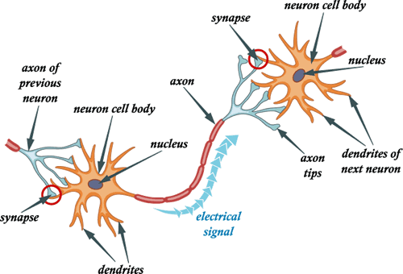
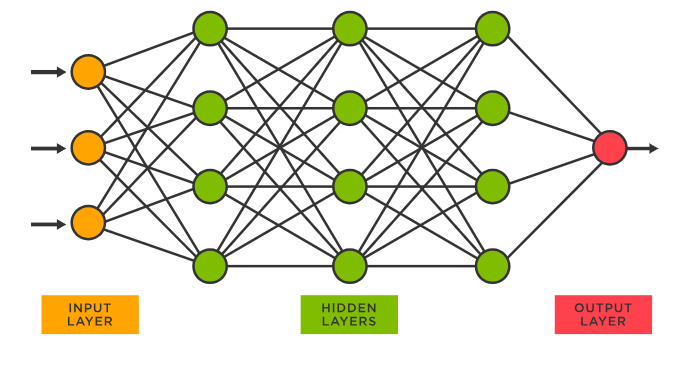

# Artificial Neural Network for a bank note

## Description

The aim of this project is to create a multi-layer perceptron (MLP) artifical neural network that reads data from a txt file of a bank note, combined with user input, and trains on them in order to classify the data of this dataset. Specifically, it reads the labeled text data file, asks the user for the size of the hidden layers of the MLP topology, the amount of neurons in each hidden layer as well as the training step and then trains on 80% of the labeled data and displays the progress graph and the confusion matrix, while classifying the ulabeled data.

## Multi-layer perceptron artificial neural network

In order to fully understand the scope of this project, it is important to explain some of the terminology and the basic concepts used throughout the program. To begin with, an artificial neural network is closely related to a biological neural network, which is found in all living creatures. Our biological neurons consist of the cell body, axons and dendrites. Specifically, the cell body directs all the activities of the neurons whereas the dendrites are the endpoints of this cell body and are the ones that receive the messages from other nerve cells. The axons are what connect one cell body with another by sending electrical signals to one another. Just like you can see in the picture, the first cell body sends messages to the second cell body through the axon. This message is received from the dendrites of the second neuron and this cell body interprets it and acts accordingly by sending the message to other neurons or body tissues. This is a chain process and it is what makes us walk, talk, move and perform any other normal function.

The structure and the way that artificial neural networks operate is inspired by biological neurons, since the input nodes of the ANN receive the input signals, the other layer nodes calculate these signals and the output layer nodes compute the final output and the final function. Within the hidden layers, just like in biological neurons, the artificial neurons learn which activities they should respond by constantly checking the errors or the differences between the predicted and the actual outcomes. A multi-layer perceptron (MLP) is a type of artificial neural network that consists of multiple layers of neurons that learn complex patterns in the data.

## Dataset
