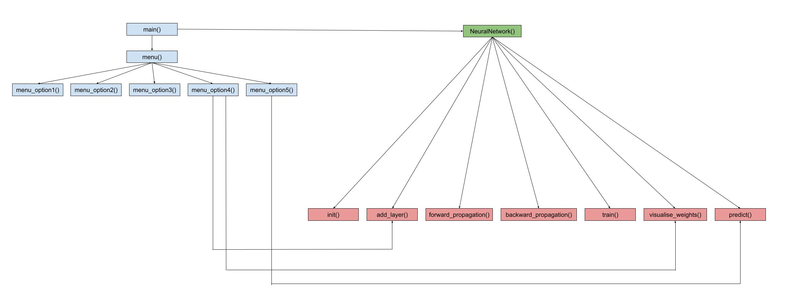

# Artificial Neural Network for a bank note

## Description

The aim of this project is to create a multi-layer perceptron (MLP) artifical neural network that reads data from a txt file of a bank note, combined with user input, and trains on them in order to classify the data of this dataset. Specifically, it reads the labeled text data file, asks the user for the size of the hidden layers of the MLP topology, the amount of neurons in each hidden layer as well as the training step and then trains on 80% of the labeled data and displays the progress graph and the confusion matrix, while classifying the ulabeled data.

## Multi-layer perceptron artificial neural network

In order to fully understand the scope of this project, it is important to explain some of the terminology and the basic concepts used throughout the program. To begin with, an artificial neural network is closely related to a biological neural network, which is found in all living creatures. Our biological neurons consist of the cell body, axons and dendrites. Specifically, the cell body directs all the activities of the neurons whereas the dendrites are the endpoints of this cell body and are the ones that receive the messages from other nerve cells. The axons are what connect one cell body with another by sending electrical signals to one another. Just like you can see in the picture, the first cell body sends messages to the second cell body through the axon. This message is received from the dendrites of the second neuron and this cell body interprets it and acts accordingly by sending the message to other neurons or body tissues. This is a chain process and it is what makes us walk, talk, move and perform any other normal function.

The structure and the way that artificial neural networks operate is inspired by biological neurons, since the input nodes of the ANN receive the input signals, the other layer nodes calculate these signals and the output layer nodes compute the final output and the final function. Within the hidden layers, just like in biological neurons, the artificial neurons learn which activities they should respond by constantly checking the errors or the differences between the predicted and the actual outcomes. A multi-layer perceptron (MLP) is a type of artificial neural network that consists of multiple layers of neurons that learn complex patterns in the data.

## Dataset

You can find details about the dataset here: [Banknote Authentication](https://archive.ics.uci.edu/ml/datasets/banknote+authentication).

## Code

The program uses Python the libraries numpy, pandas, matplotlib and sklearn as well as different functions that add neurons to each hidden layer, perform the forward propagation and the backward propagation, train the dataset, produce the graph for the weight changes and epochs and classify the unlabeled data. Throughout the entire process, there is also error trapping in case the user enters an invalid input as well as if any other error occurs. In more detail, there are 6 menu options that the user can chose from: 

and includes a 6 menu option with the following possible tasks that the user can choose from: 
1. Read the labelled text data file, display the first 5 lines: Extracts the data from the txt file, assigns labels and then saves them in a new txt file that will be used from training.
2. Choose the size of the hidden layers of the MLP topology (e.g. 6-?-?-2): Asks the user for the size of the topology (the amount of hidden layers) and the neurons that each layer should have.
3. Choose the size of the training step (0.001 - 0.5, [ENTER] for adaptable): Asks the user for the size of the training step, which could be either 0.001, 0.5 or somewhere inbetween that range.
4. Train on 80% of labeled data, display progress graph: It splits the data into training and testing set, adds the hidden layers that the user previously entered and trains on 80% of the data based on the training step that the user entered. Afterwards, it produces the progress graph with how each neuron evolves during the training process.
5. Classify the unlabeled data, output training report and confusion matrix: After having trained on the training set, it tests on the testing set and sees how it performs on that set by finding the accuracy and producing a confusion matrix.
6. Exit: Stops the program.

## Function Interconnectivity Diagram

The image below describes how the functions are connected with each other to better visualise the process:

